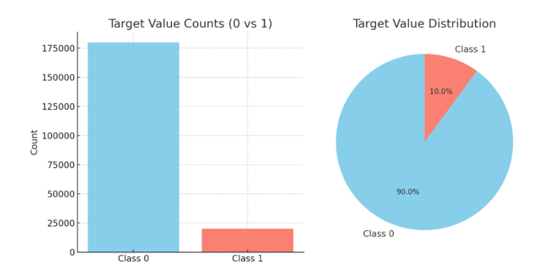
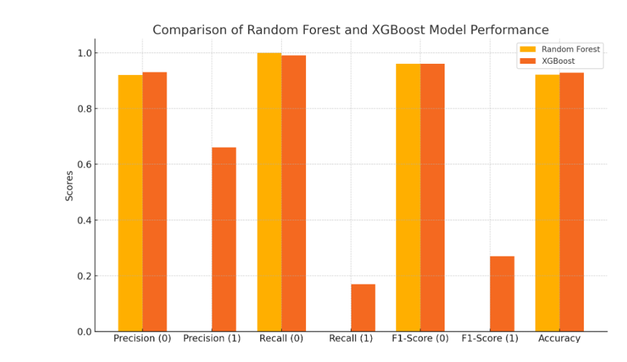

# Transaction Customer Prediction Project
## Project Background and Overview
This project aims to predict whether a customer will make a transaction, given their historical banking data. The dataset contains 201 features, with a binary target column (0 for no transaction, 1 for transaction). The challenge lies in classifying transactions effectively while handling a highly imbalanced dataset.

## Data Structure Overview
Features: 200 input features representing customer behavior.
Target Column: Binary column with 1 indicating a transaction and 0 indicating no transaction.
Preprocessing: Missing values, duplicates, and outliers were handled. Data was scaled using StandardScaler before training the models.

## Executive Summary
We used Random Forest Classifier and XGBoost Classifier for predicting customer transactions. Both models performed well, but XGBoost slightly outperformed Random Forest, achieving an accuracy of 92.81% vs 92.15%. Random Forest showed strong performance for class 0 (no transaction) but struggled with class 1 (transaction), resulting in lower metrics like recall and F1-score for the minority class. XGBoost, however, improved the precision, recall, and F1-score for class 1, making it better at handling the minority class.

## Challenges Faced:
1. Limited Domain Knowledge: The dataset was anonymized, making feature selection challenging.
2. High Dimensionality: PCA was applied but did not yield improved results, so we used the full dataset for model training.
3. Limited Control Over Methods: We had to rely on existing methods, with minimal control over feature engineering or model selection.

## Conclusion
We successfully solved the problem of predicting customer transactions by developing a predictive model. XGBoost proved to be the better model, particularly in handling the imbalanced nature of the dataset. The project demonstrates the importance of selecting the right model for imbalanced classification tasks.

## Recommendations
Use Pickle to save models for reusability.
Utilize n_jobs > 1 for faster training on large datasets.
Scale the data after splitting to prevent data leakage.
Choose models that handle imbalanced data well, like XGBoost.
Use Random Search for hyperparameter tuning before resorting to Grid Search.
Use Sweetviz or Dtale for efficient EDA.