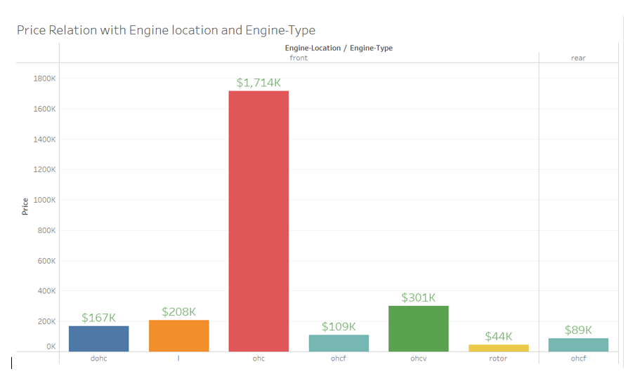

# Car Price Prediction
## Project Background and Overview
The goal of this project is to predict the price of a car based on its characteristics using machine learning. 

The dataset, sourced from the car industry, contains 201 records and 26 attributes, with the target column being the "price." 

This problem is classified as a regression problem, where the target is continuous. The task is to develop the best predictive model to forecast car prices.

## Data Structure Overview
Target Column: Price (Continuous numeric value).

Features: 25 independent variables (including car make, model, year, mileage, etc.).

Size: 201 rows and 26 columns.

## Executive Summary
We applied various machine learning models to predict car prices, ranging from traditional regression techniques to ensemble methods:

Initial models like Linear Regression and Lasso Regression achieved good r2-scores (~91.5%).

Random Forest Regressor showed an r2-score of 93.4%, while XGBoost Regressor outperformed all, achieving 95.6%.

Despite attempts at hyperparameter tuning, no significant improvements were seen. XGBoost was retained as the final model.

Key Challenges included handling disguised missing values ('?') and choosing appropriate models for the data's structure.

## Report on Challenges Faced
1. Column names were in a separate file, requiring extra data manipulation.
2. Missing values were disguised as ‘?’ and had to be identified and handled.
3. Many categorical columns required encoding, which added complexity.
4. The dataset was small, limiting the model's training effectiveness.

## Recommendations
1. Use XGBoost for regression tasks in similar domains.
2. Consider Grid Search for hyperparameter tuning, though it may not always improve results in small datasets.
3. Implement robust handling of missing values with techniques like Iterative Imputer to reduce bias.
4. Ensure careful handling of categorical variables for models not native to them (e.g., using encoding techniques).
5. MinMax Scaling is recommended for skewed data distributions, as applied in this project.

## Conclusion
We have successfully solved the problem by creating the best predictive model for forecasting car prices.

