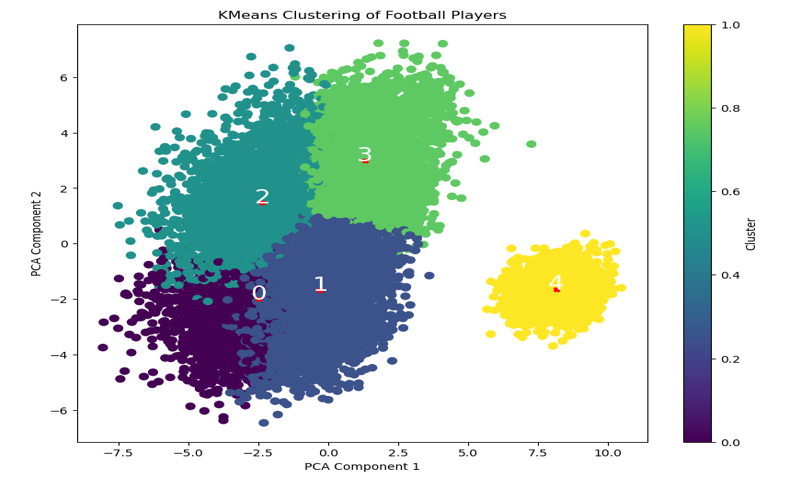
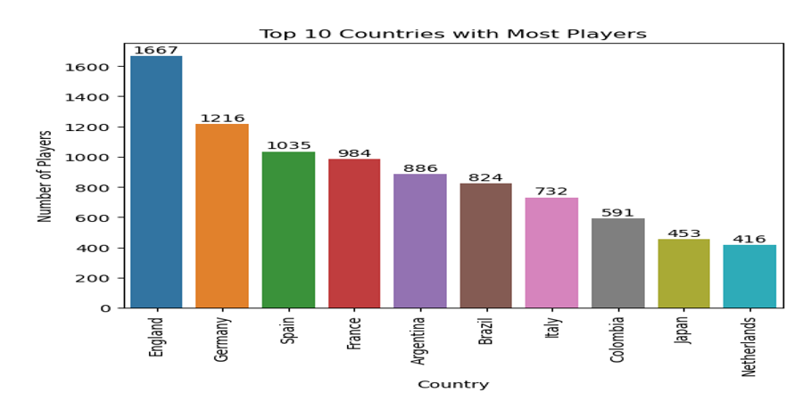
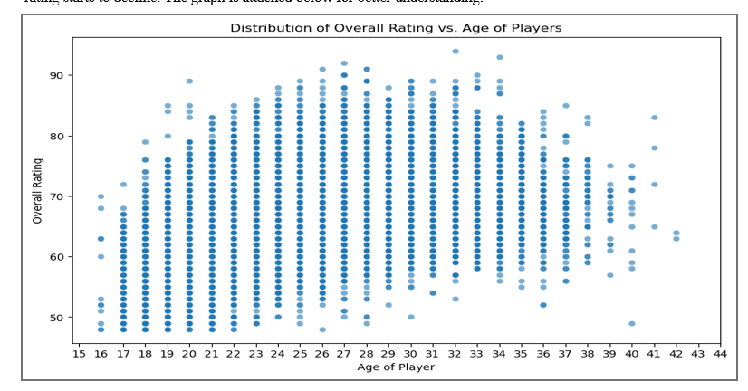
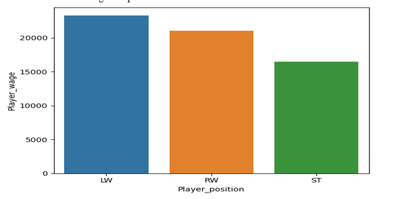

# Football Players Clustering

## Purpose of the Report
The purpose of this report is to provide a comprehensive data analysis on a football dataset, exploring player skills, clustering football players based on various performance attributes, and extracting insights related to player rankings, age, and remuneration based on positions.

## Overview of the Dataset
Domain: Sports
Number of Features: 102 total features
16 Float Features
45 Integer Features
41 Categorical Features

Key Attributes:
Player skill ratings (e.g., overall, potential)
Personal attributes (age, height, weight)
Country of origin and position
Remuneration (wage, value in EUR)

Missing Values: Several columns contain a significant number of null values, which were addressed during preprocessing.

## Objectives
1. Explore football skills and cluster players based on the given attributes.
2. Identify the top 10 countries with the most players and their distribution by rank.
3. Analyze the distribution of players’ overall ratings and the age at which they stop improving.
4. Examine the remuneration of players based on their position.

## Data Preprocessing & Feature Engineering
### Data Cleaning:
Removed irrelevant columns that did not impact analysis.
### Feature Extraction:
Extracted important features and discarded those like birth month/date which weren't necessary.
### Handling Missing Values:
Identified and dropped columns with more than 50% missing data to ensure model accuracy.
### Duplicate Check:
No duplicates found in the dataset.
### Handling Outliers:
Outliers were found in multiple features (e.g., age, height, weight, wage).
DBSCAN clustering was applied to detect and handle these outliers effectively.

## Task 2: Football Skills Exploration & Clustering
### Categorical Column Handling: Processed categorical columns.
### Scaling: Features were scaled using the standard scaler.
### Clustering:
1. Applied K-means clustering to group football players based on their skill attributes.
2. PCA was used for dimensionality reduction to visualize the clusters effectively.
3. Players were grouped into distinct clusters, and a scatter plot was used to represent these clusters.

### Task 3: Top 10 Countries with the Most Players
1. The top 10 countries with the highest number of football players were identified.
2. A bar plot was used to visualize the number of players from each country.

## Executive Summary
This report presents an analysis of a football player dataset, focusing on exploring player skills, clustering players, and analyzing player remuneration. Key insights include:

1. Top Countries: England has the highest number of players (1667) while the Netherlands has the fewest (416). A bar plot illustrates the number of players per country.

2. Overall Rating vs Age: A scatterplot reveals that players improve until the age of 32, after which their ratings decline.

3. Highest-Paid Position: Left-wingers earn the highest wages, followed by right-wingers and strikers, as depicted in a bar plot.

4. Additional Analysis: 
1. Comparison between Messi and Ronaldo:
The stats of both players are listed and compared, we can highlight some of the facts:
-	Messi is the youngest player to start playing from the year 2004.
-	Ronaldo first featured in the game in 2018 only.
-	Both the players are well-established and known to all but, Ronaldo tops Messi in terms of strength, power and stamina.
-	Messi earns a higher wage than Ronaldo, possibly because of his long-term significance to Barcelona, his global appeal, and his historically high earnings. In contrast, Ronaldo’s move to Juventus might have involved a different salary structure and financial considerations specific to the club.
-	Even though Messi has been in form for many years, based on their achievements Ronaldo outperforms Messi.
2. Budget of a Team: The budget to form a competitive team with the top 11 players is 3410000 Euro.
3. Average statistics of top players: overall- 81.040526, potential- 82.778751, wage_eur- 67474.260679, age- 27.889376, dribbling- 74.296755, shooting- 64.698046, passing- 70.646415, defending- 62.233520.
4. Average statistics of other players: overall- 65.467089, potential- 70.956349, wage_eur- 6406.564929, age- 25.146271, dribbling- 61.846055, shooting- 50.877525, passing- 56.578777, defending- 52.015552.
5. The position of the top 5 players: The top players are usually kept as a substitute. Secondly, the goalkeeper position has the higher number of players. The position of the top 5 players is placed in the below graph:

## Recommendations
1. Improve Missing Value Handling: While null values were addressed by removing columns with over 50% missing data, a more sophisticated imputation strategy could be beneficial.
2. Clustering Method Improvements: DBSCAN was implemented for better outlier detection; however, further experimentation with other clustering algorithms may refine player groupings.
3. Consider Additional Metrics: Including team performance data or player injuries could provide a more comprehensive view of player value and potential.

